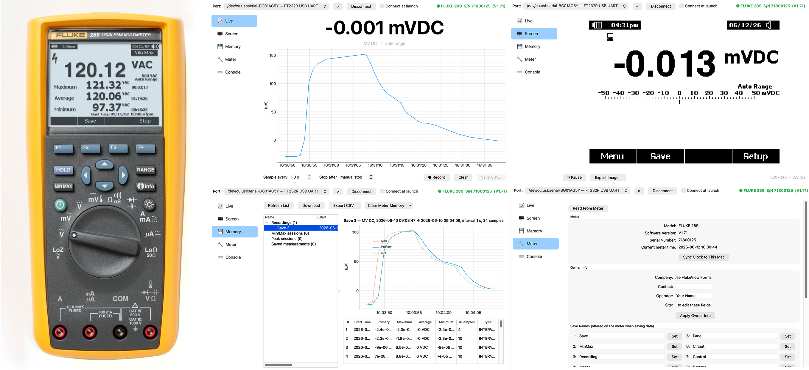
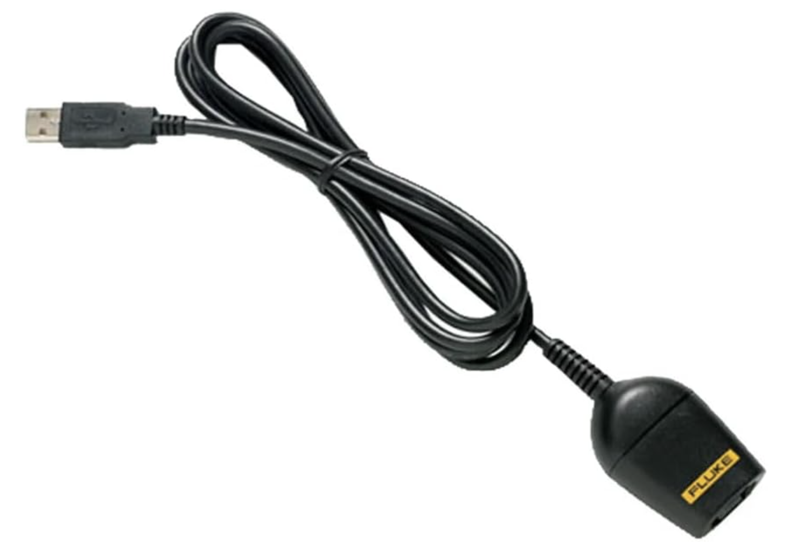
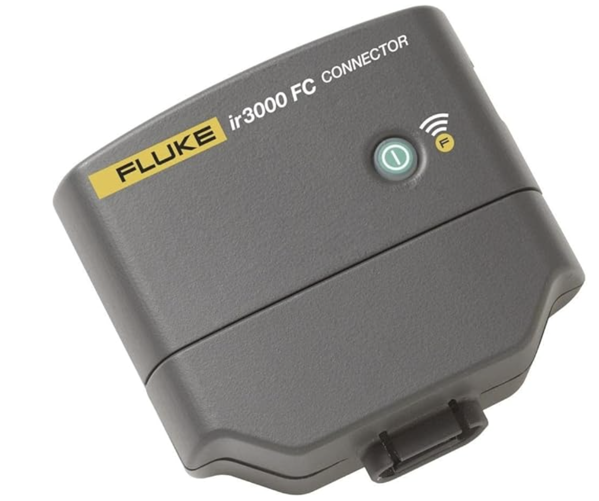
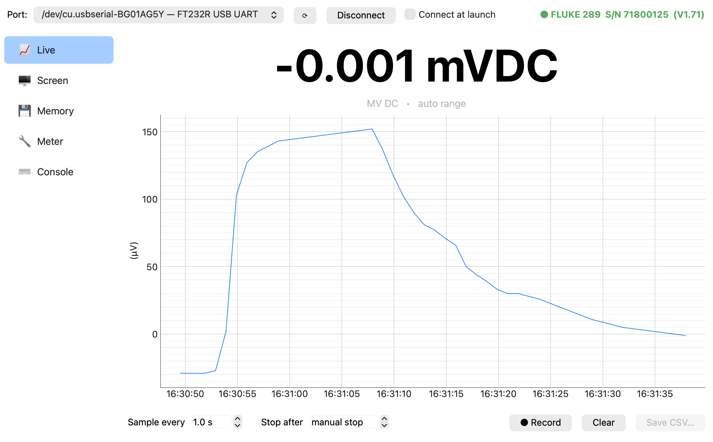
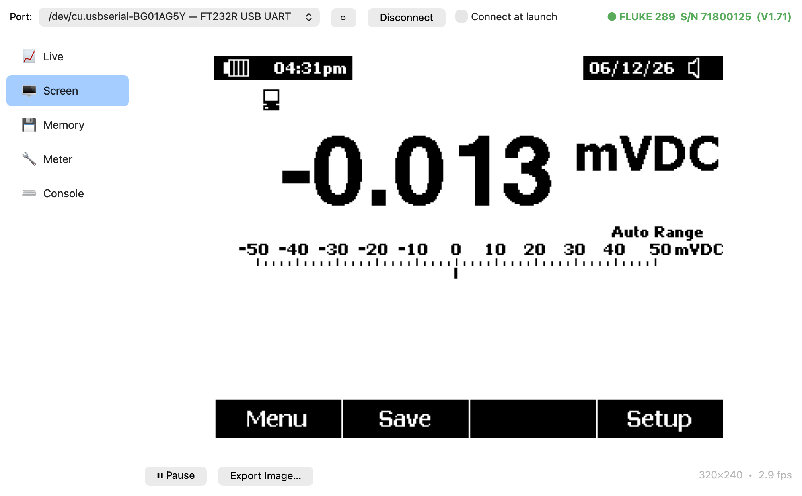
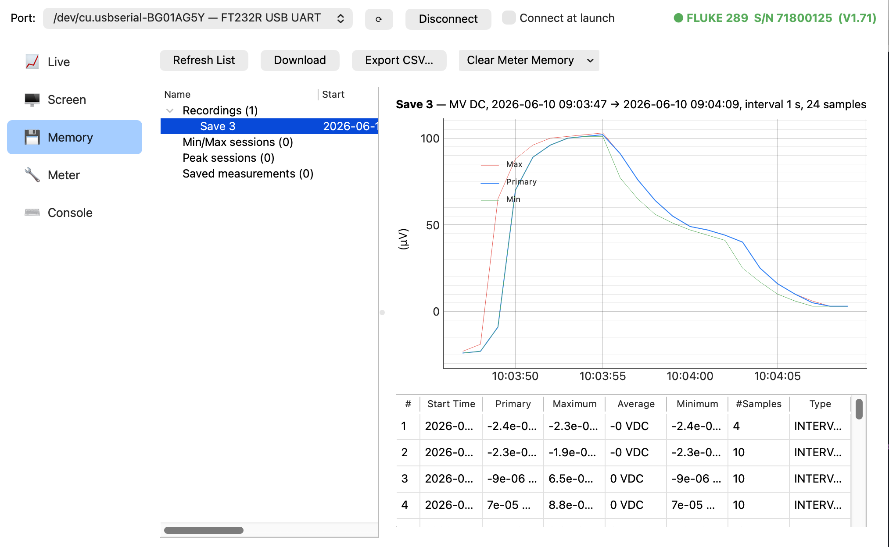
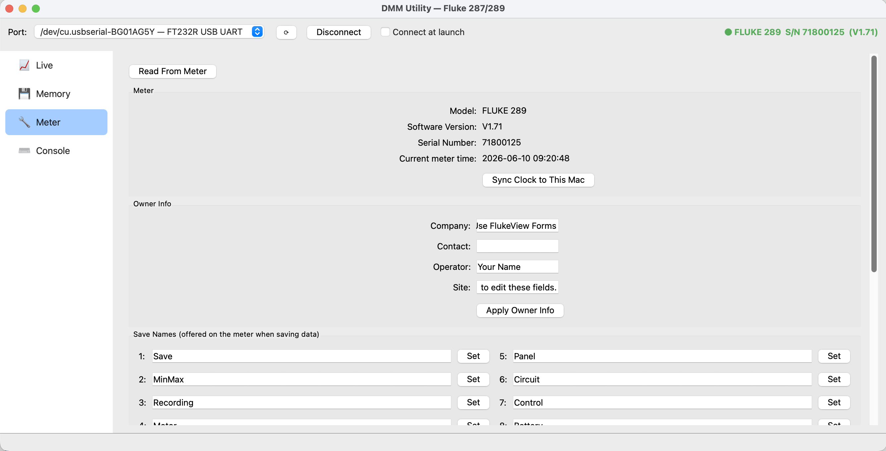
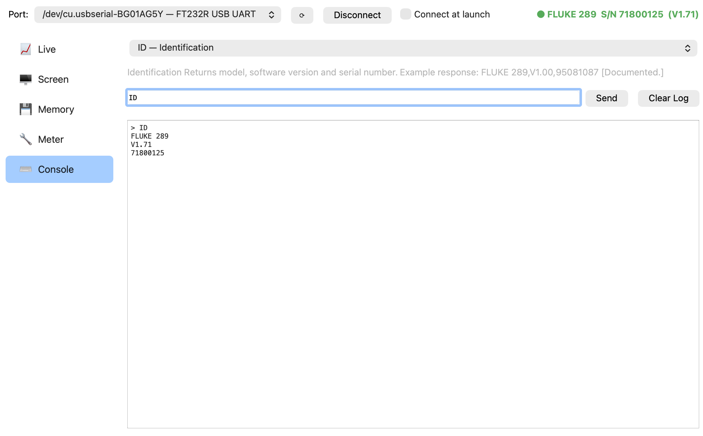

# DMM Utility GUI for Fluke 289 Multimeter



This project is a full-featured app that provides remote connectivity for the Fluke 289/287
digital multimeter. It started as a fork from `dmm_util`, but it's moved pretty far beyond that
command line interface. I wasn't happy with Fluke's software, so I asked Claude Fable 5
to build a nice GUI around the DMM serial commands. Initially I was frustrated that there's
no Mac app and that the iOS app only shows live data. But as I got into this project, I
learned that there's a lot of functionality not exposed in the Fluke apps. If you're
curious about how I started Claude on the work, read the prd.md file and see
Claude's summary.md file of the work completed.

This app is engineer-centric, so no frills on the UI, but it exposes everything in the
meter protocol we could find, including some undocumented stuff. There's even a live screen
image view of the meter, thanks to some code I found on EEVBlog from user vslives.
See fluke-live.py for their original code. That file isn't used in the app and can
be run standalone if you only want a screen capture view.

I've only tested this on the 289 meter running firmware version 1.71.
I assume the documented commands are the same with 287. I'm not sure about the
undocumented ones, notability the delete memory options and the screen capture.
I've tested this mostly on Mac, but since it uses the QT library, it does run
on Windows, too. I did a quick cursory test on Windows 11 with the USB
interface, and it seems fine. And as always with Windows,
you'll need the proper [FTDI serial drivers](https://ftdichip.com/drivers/).
These are already part of MacOS. I can't test BLE on Windows yet because
I'm testing in a Parallels VM, and native BLE isn't supported with a Bluetooth dongle.

## Connection Methods

Fluke sells two interfaces for this meter.

1. Fluke IR189USB - an optical-to-USB interface for connecting to a laptop.
2. Fluke IR3000FC - an optical-to-BLE interface for connecting to a phone.




**Note: The USB interface provides MUCH more functionality than the BLE one.**
Most of the functionality in this app relies on the USB interface,
so that's the one to buy. The USB interface has a text
command protocol with a mixture of text and binary responses. You can
connect over your favorite terminal app and talk directly to the meter
if you want. The PDF spec in this repo describes this interface.

The BLE interface only supports live data from the meter. I didn't
realize this, and I bought the BLE first. (Always read the reviews!) I
was very disappointed when I ran FlukeConnect on my iPhone and
discovered I couldn't download on-meter recorded data. But my mistake
is your gain, because I added support for the BLE interface in this
app, too.

More tech details: The BLE interface doesn't seem to implement the text protocol that
the USB interface does. Instead, it's a binary streaming interface
that just broadcasts live updates from the meter in binary. While
I was able to send text commands, it returned an error code on them except
for the ID command. From searching online, it appears that no one
has cracked this binary interface yet, or at least they're not
sharing their work if they did. If you have more information
about the binary protocol, please contact me. I'd love to implement
it in this app.

Anyway, Claude and I worked to decode the live BLE streaming data, so the live
view screen works over a BLE connection. Everything else is disabled when you
use BLE. But I suppose the benefit is that you can do your own data recording from
your laptop using the BLE interface, so you don't have to be physically attached to the
meter for that.

**Note: As noted, the BLE protocol is undocumented. It's possible that there
are bugs.** Please file an issue if you find something.

## Features

When you start the app, you must pick the port to connect to. Assuming
you have the USB connector, you'll see the FT232R UART on /dev as shown
in the image below. On Windows, you'll see COM ports instead.

If instead you want to find the BLE adapter, hit the refresh button and wait a few
seconds. The scan has a 10s timeout, but if you have a ton of BLE devices in your house,
you may need to increase the scan time. The status bar will tell you if it finds
the BLE adapter. Again, I've only tested this on Mac, so I'm not sure if it
works on Windows. (Parallels doesn't pass BLE connections to the VM, so I have to
buy a dongle to test BLE on Windows.)

Once you've picked your connection, hit connect. If you're using the USB interface,
all of the screens will be available to you. If you're using the BLE interface, you'll
only have the live data screen.

Note that settings (port, auto-connect, sample interval, window layout) persist between
launches. Tooltips throughout explain what each control sends to the meter.


### Live View

This is a big live readout, a rolling plot, and session recording at a configurable
sample rate with optional auto-stop duration. Allows you to save sessions as CSV.



### Screen View

This provides live screen capture of the DMM screen itself. Pretty cool, but sort
of redundant. It could be cool if you could remotely control the meter, but if that works,
it's not in the published protocol. Again, if you know of any undocumented commands,
please get in touch with me!



### Memory View

This lists everything stored on the meter (recordings, min/max, peak, saved measurements),
allows you to download recordings with progress/cancel, plots primary/min/max, exports any
item to CSV, and allows you to delete all memory. Deleting memory is an undocumented command,
and you can't just selectively delete one recording.



### Meter View

This provides identity and configuration, syncing the meter clock to your laptop (super cool!),
and editing stored owner info (company/contact/operator/site). You can edit the default 8 save-name slots,
and send the DS/RMP/RI reset commands.



### Console

This is kind of a debug screen. You can send any protocol command raw, with a picker and tooltips for
every known command (documented and reverse engineered). Binary responses are shown as a hex dump.



## Running It

```sh
python3 -m venv venv                      # once, if you don't have the venv
venv/bin/pip install -r requirements.txt  # once
venv/bin/python -m dmm_gui
```

Pick the IR cable's port (it shows up as `/dev/cu.usbserial-…`, FTDI ports are
listed first), press **Connect**, and check *Connect at launch* if you want the
app to reconnect automatically next time.

## Building a Mac app bundle

```sh
venv/bin/pip install pyinstaller   # once
packaging/build_app.sh
```

This regenerates the app icon and produces `dist/DMM Utility.app`
(ad-hoc signed); drag it to /Applications to install. The bundled app and
the run-from-source version share the same saved settings.

## Testing

(no meter needed — runs against a simulated Fluke 289):

```sh
venv/bin/python tests/test_protocol.py
QT_QPA_PLATFORM=offscreen venv/bin/python tests/test_gui.py
```

## Original docs from the forked CLI dmm_util repo

dmm_util is a utility for interacting with Fluke 289 and 287 Series multimeters.
You can:

- download saved measurements
- download saved recordings
- download saved min-max
- download peaks
- set date and time
- set internal data such as company,contact,operator,or site
- display realtime measurements
- set available record names list
- display configuration information

This is a complete rewrite of [Fredrik Valeur dmm_util](https://github.com/fvaleur/dmm_util)  
Previous one was written in Ruby. This one is written in Python 3.  
There are also some changes to the code.

### Prerequisites

**Python 3.10+** and pyserial must have been installed before use.

many things have been added as we go along. So the code is not optimal.

**Important**  
All the data displayed are those returned by the multimeter.  
None is calculated or processed

**How to install it:**

1. - Using PyPi (the simplest way)  
Latest **release** can be installed by typing:  
`python -m pip install fluke_28x_dmm_util`  
[](https://badge.fury.io/py/fluke-28x-dmm-util)  
[](https://pepy.tech/project/fluke-28x-dmm-util)

2. - From github (newest version):  
Latest **commit** can be used by typing:  
`git clone https://github.com/N0ury/dmm_util.git`  

3. - From Github [release](https://github.com/N0ury/dmm_util/releases)  
  
Get the latest release and unzip (or gunzip) it  
cd to the folder that has been created and run the utility as shown above.
**How to run the utility**  
Main command is:  
`python -m fluke_28x_dmm_util -p PORT ...`  

**If you have installed the release (.zip or /tgz), you need to change directory to the one of installation. The directory before running the utility MUST be dmm_util.**

If you have installed the PyPi version this is not necessary, and you can run the utility anywhere.  

Syntax:  

`python -m fluke_28x_dmm_util options command`  

### Options

{-p|--port} PORT  
This is mandatory, it's the port to which the DMM is connected (eg: COM3)

{-s|--separator} SEPARATOR  
Separator is optional. Default is TAB  

{-t|--timeout} TIMEOUT  
Timeout is optional. Default is 0.09 (in seconds)  
You need to change this only if timeouts occur.

{-o|--overloads}  
Don't display lines containing overloads (lines with values 9.99999999e+37) or invalid values  
Applies to `get recordings` only  

### Command

This depends on what you want to do  

- get:  
get recordings {name | index} [,{name | index}...]  
get minmax {name | index} [,{name | index}...]  
get peak {name | index} [,{name | index}...]  
get measurements {name | index} [,{name | index}...]  
get current: get current measured values  
get config: get DMM configuration  
get names: get DMM names prefix used for storing data  

'name' is the name used for a recording, 'index' is a number  
These data can be displayed with 'list' command,  
'name' can be surrounded by quotes in case it contains spaces.  
If this parameter contains only digits, value is assumed to be an index.  
Otherwise, it will be taken as a name. Multiple names or indexes are permitted, they must be comma separated, with no spaces before or after the commas.  

Example:  
get recordings 1,"Record 2",5  
get recordings 3  

This command displays detailed recordings informations

- set:  
set company <value>: set DMM company name  
set operator <value>: set DMM operator name  
set site <value>: set DMM site name  
set contact <value>: set DMM contact name  
set datetime: set DMM date and time to the PC current date/time  
set names <index> <name>: set the name of recording at given index  

'index' is a value between 1 and 8. List can be obtained using 'get names'.  

Example:  
set operator N0ury  
set name 2 Min_Max  

- list  
list recordings: list recording type recordings  
list minmax: list min/max type recordings  
list peak: list peak type recordings  
list measurements: list all the measurements  
list all: list all the memory stored values  

This command displays general informations about recordings  

### Common issues

```python
  File "python3_dmm_util.py", line nn
    match len(name):
            ^
SyntaxError: invalid syntax
```

You are using Python version less than 3.10, consider upgrading.

```python
Traceback (most recent call last):
  File "python3_dmm_util.py", line 4, in <module>
    import serial
ModuleNotFoundError: No module named 'serial'
```

pyserial module is needed.
Install it this way  
`python -m pip install pyserial`

### Copyrights

Copyright © 2011 Fredrik Valeur. (Original CLI DMM utility)<br>
Copyright © 2017-2022 N0ury. (Original CLI DMM utility)<br>
Copyright © 2026 Doug Gaff.<br>
Credit to vslives from EEVBlog for the DMM screen capture
